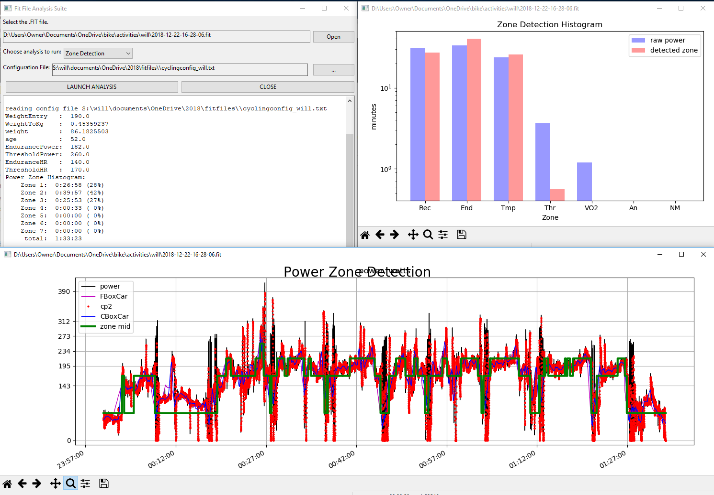
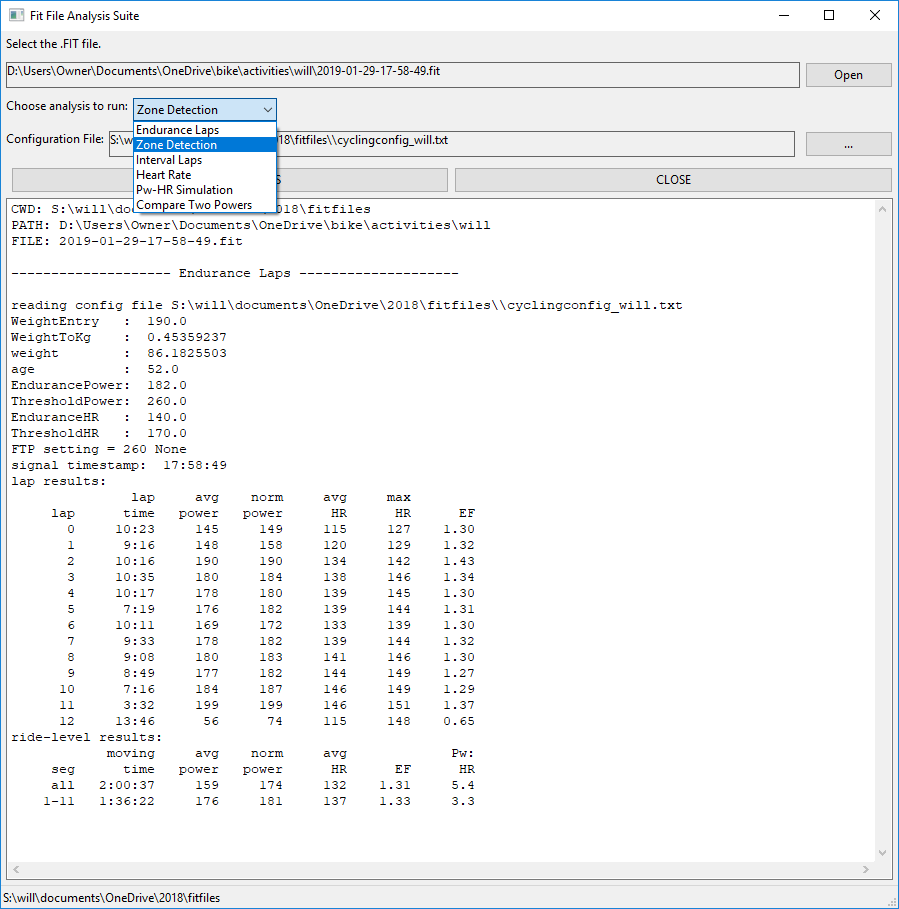
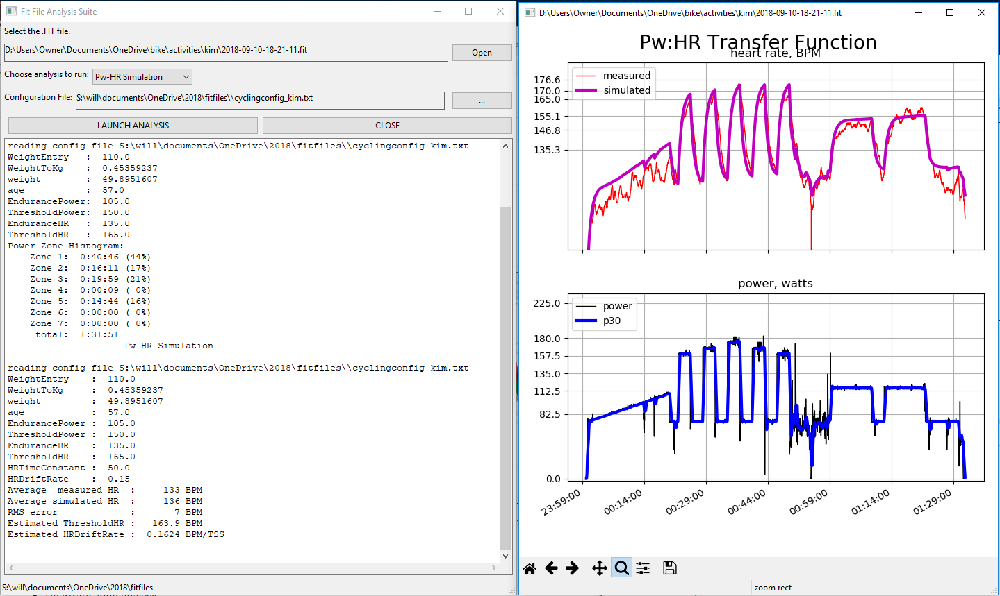

# FitFiles
A collection of analysis routines for .FIT files from Garmin devices.

## Screenshots

<table>
    <tr>
        <td>
            
        </td>
        <td>
            
        </td>
        <td>
            
        </td>
    </tr>
</table>

##  Overview of capabilities
-   **Fast access to custom analyses of selected FIT file.**
-   **Endurance laps.** This analysis plots and prints lap metrics related to an endurance workout (e.g., time, average and normalized power, average heartrate, efficiency factor). It is useful to track the progression of the workout and assess the effects of fatigue.
-   **Power-zone detection.** This analysis uses an innovative algorithm to detect the power zone at every time instance in a way that requires the power to stay in that zone for a length of time that varies by zone. For example, 5 seconds at 300W (zone 5 for me) is not enough time to say that I am actually in zone 5. This results in a much more realistic power-zone histogram. It is very useful for analyzing races and other hard unstructured workouts.
-   **Intervals.** This analysis detects laps with average powers above the aerobic threshold for tabulation. It completes with a time-averaged power sum so that you can know, for example, how many total minutes you spent in zone 4.
-   **Heartrate zone analysis.** This analysis calculates calories from heartrate and provides a heartrate-zone histogram (both text and plot).
-   **Heartrate simulation from power.** This analysis uses a first-order dynamic model that computes heartrate from power. Its primary use is to determine heartrate offset ("is it high or low or normal?") and cardiac drift for an arbitrary workout--that is, the workout does not have to be structured; even races can be analyzed. Cardiac drift is modeled as proportional to fatigue in BPM/TSS.

##  How to launch using the batch file (fitfileanalyses.bat)

The application (fitfileanalyses.py) is most conveniently launched using the Windows Command batch file, fitfileanalyses.bat. This can be done by double-clicking the batch file or by drag-dropping a .FIT file onto it in Windows Explorer.

**You may need to edit to set the base code directory.** The batch file needs to know where the application (fitfileanalyses.py) is stored. It sets a variable %base% to this folder. If double-clicking the batch, then base can be set to %CD% (comment out lines accordingly using `REM`). However, if you are drag-dropping .FIT files from another folder, you will need to set %base% explicitly to the folder you save the application in.

##  User config files.
Most analyses need to know some things about the athlete:
- **weight**
- **age**
- **sex**
- **ThresholdPower** FTP
- **EndurancePower** Generally set to 70% of FTP
- **ThresholdHR** Functional Threshold Heartrate (FTHR). This is the average heartrate during an FTP test interval.
- **EnduranceHR** Generally set to FTHR minus 30 BPM or to 0.82*FTHR. It is the heartrate corresponding to the EndurancePower.
- **HRTimeConstant** This is used by the heartrate simulation analysis and represents how quickly the heartrate responds to changes in power.
- **HRDriftRate** This is used by the heartrate simulation analysis and represents cardiac drift as proportional to fatigue in BPM/TSS. Typical values are 0.1-0.2 BPM/TSS once aerobic endurance is developed.

See the files cyclingconfig_will.txt and cyclingconfig_kim.txt for examples. Create your own and select it when running the application.

##  How to install
This section lists dependencies with tips on how to install them.

###   Python 2.7
Get Python 2.7 from

https://www.python.org/

Install to C:\Python27\

It may be necessary to add `C:\Python27\` to the path environment variable.

###   NumPy
At a command prompt directed to C:\Python27\, enter,
> `python -m pip install numpy`

###   SciPy
At a command prompt directed to C:\Python27\, enter,
> `python -m pip install scipy`

###   MatPlotLib
At a command prompt directed to C:\Python27\, enter,
>   `python -m pip install matplotlib`

###   wxPython GUI library
At a command prompt directed to C:\Python27\, enter,
>   `python -m pip install -U wxPython`

###   FitParse
 FitParse is a python library for parsing .FIT activity files
 developed by DT Cooper and available at,

 https://github.com/dtcooper/python-fitparse

 However, this uses a modified version of the old release that
 I made (to handle left-right balance). Simply copy the following files
 from the folder fitparse_mod:

            fitparse_mod/__init__.py
            fitparse_mod/activity.py
            fitparse_mod/base.py
            fitparse_mod/exceptions.py
            fitparse_mod/profile.def
            fitparse_mod/records.py

 into,

        C:\Python27\Lib\site-packages\fitparse\

